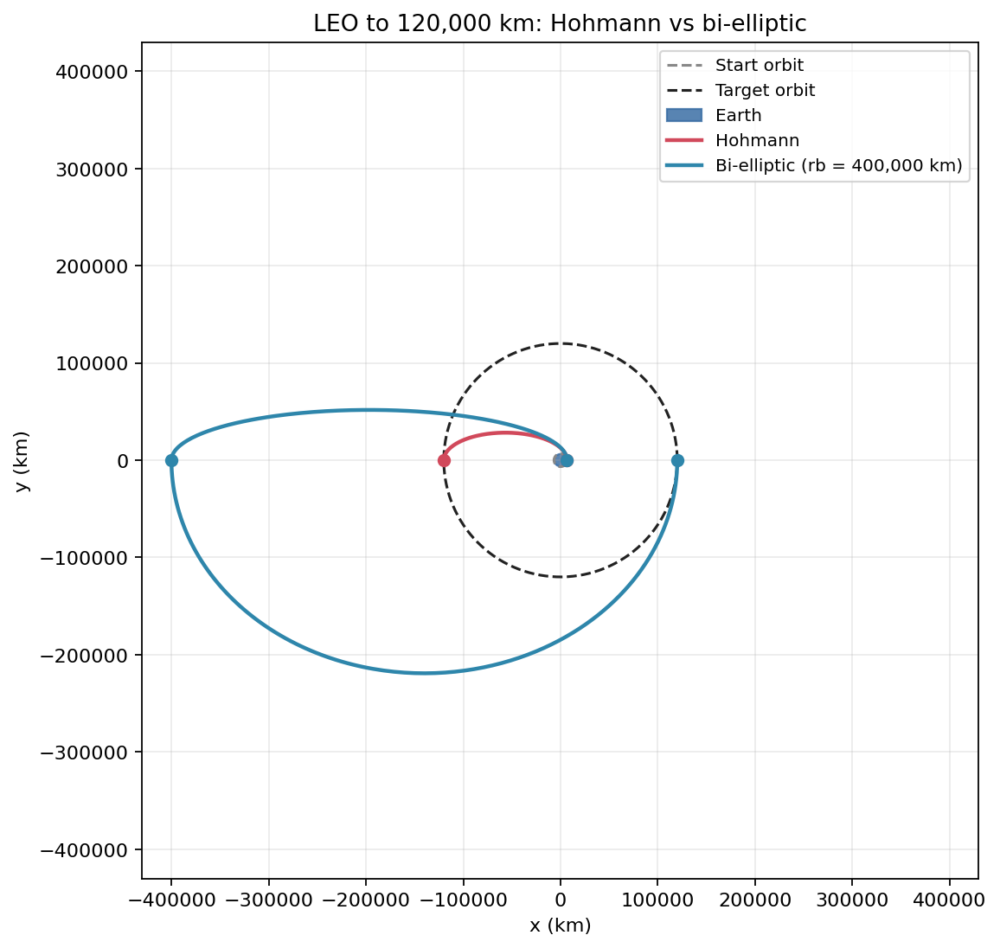
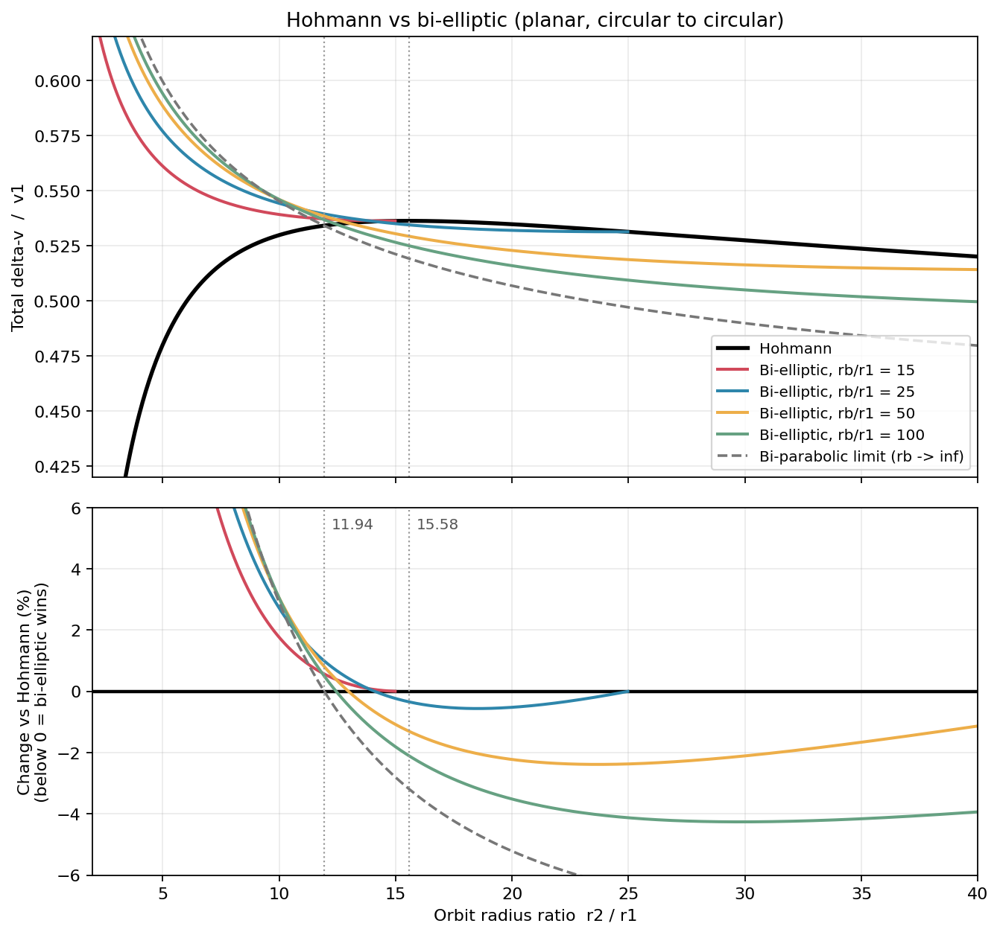
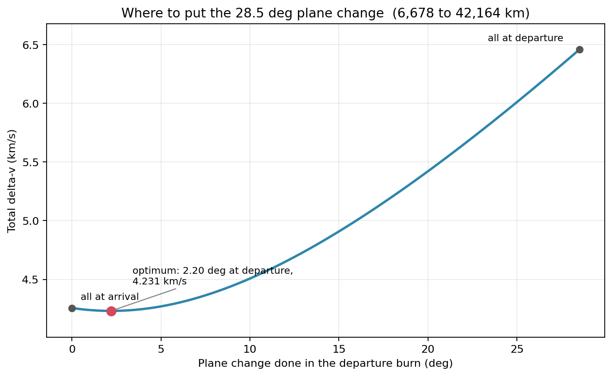
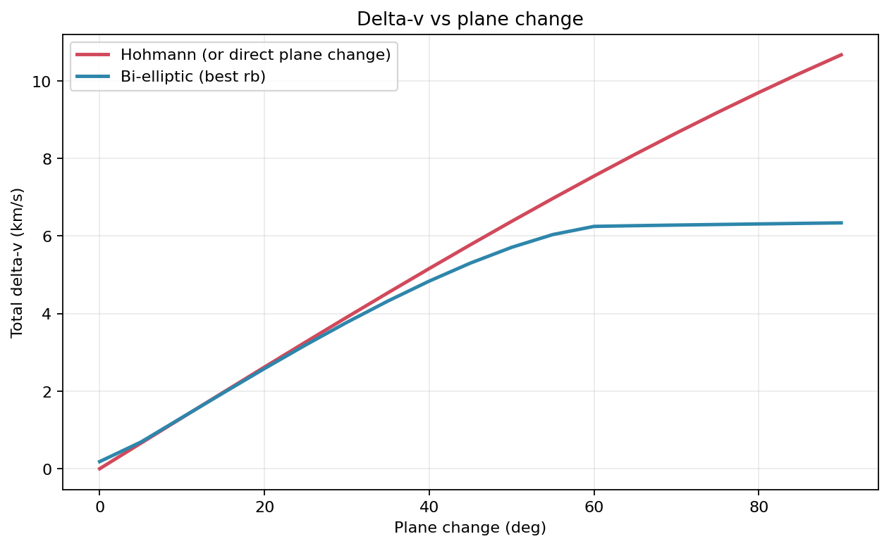

# Orbit Maneuver Optimizer


[](https://github.com/Sohaila2306/Orbital_Optimization/actions)

A small Python toolkit for answering one of the oldest questions in mission design: **what's the cheapest way to get from this orbit to that one?**

It compares **Hohmann** and **bi-elliptic** transfers for both coplanar and non-coplanar orbits, and tells you the delta-v, the propellant, and how long you'll be waiting. It can also fly each transfer in a numerical simulation to check the maths, and plot the results.

<p align="center">
  
</p>

## Why this exists

Everyone learns that the Hohmann transfer is the minimum-energy way to move between circular orbits. Fewer people remember that it *isn't always the cheapest*: if the target orbit is more than about 12-15 times larger, swinging way out and coming back (the bi-elliptic transfer) can use less delta-v, at the cost of a much longer trip. Add a plane change and the picture gets even more interesting, because where you do the turn matters a lot.

Textbooks give you the formulas. I wanted something I could just *run*, tweak, and trust: so every transfer here can be flown numerically and checked against the formulas.

## What it can do

- **Hohmann and bi-elliptic transfers**, inward or outward, around any body (Earth, Moon, Mars, Venus, Jupiter, the Sun, or your own)
- **Non-coplanar transfers** with the plane change placed at departure, arrival, the apoapsis burn, or *optimally split* across all the burns
- **Automatic search for the best bi-elliptic apoapsis** (`rb`), within sensible limits
- **Propellant budgets** from the rocket equation, burn by burn
- **Timing**: transfer duration, phase angle, synodic period, and how long until the next launch window
- **Simulation**: a two-body RK4 integrator that applies the burns to a simulated spacecraft and reports how close the result is to the plan
- **Plots**: 2D/3D trajectories, the classic delta-v vs radius-ratio chart, plane-change tradeoffs, fuel vs time
- **A command-line tool** for quick answers, and a plain Python API for anything bigger

## Install

You need Python 3.9 or newer.

```bash
git clone https://github.com/Sohaila2306/Orbital_Optimization.git
cd Orbital_Optimization/orbit-maneuver-optimizer

python -m venv .venv
source .venv/bin/activate        # Windows: .venv\Scripts\activate

pip install -e .
```

That installs the `orbit-maneuvers` command plus the only two dependencies: NumPy and Matplotlib. (Run these from inside the `orbit-maneuver-optimizer` folder. Prefer not to install it? `pip install -r requirements.txt` and run things with `PYTHONPATH=src python -m orbit_maneuvers ...`.)

## Try it in 30 seconds

A 5-tonne satellite starts in a 300 km parking orbit at 28.5 degrees (a Cape Canaveral launch) and needs to reach geostationary orbit:

```bash
orbit-maneuvers compare --r1 300 --r2 35786 --altitude --inc1 28.5 --mass 5000 --isp 320 --simulate
```

```
Earth: r1 = 6,678 km  ->  r2 = 42,164 km   (ratio 6.31, plane change 28.50 deg)

Method       rb (km)  Burns  Delta-v (km/s)  Duration  Propellant (kg)  Prop. %
-----------  -------  -----  --------------  --------  ---------------  -------
Hohmann            -      2         4.231 *  5h 17m +          3,701.7     74.0
Bi-elliptic   44,272      3           4.243   18h 02m          3,706.6     74.1

* lowest delta-v    + shortest duration

Notes:
  - Hohmann is cheaper here by 11.9 m/s.
  - Bi-elliptic tends to win for large plane changes or large orbit ratios; this mission sits on the Hohmann side of that line.

Simulation check for Hohmann
  delta-v: formula 4231.307 m/s, simulated 4231.307 m/s (diff -0.000 m/s)
  final radius off by -2.4 m, eccentricity 1.53e-07
  plane change achieved 28.5000 deg (error -0.0000 deg)
...
```

Note how the optimiser puts only about 2.2 degrees of the plane change in the LEO burn and the other 26.3 degrees at GEO, where the spacecraft is slow and a turn is cheap. Add `--details` to see that burn-by-burn.

Now try something past the crossover ratio, a trip from low Earth orbit out to 120,000 km:

```bash
orbit-maneuvers compare --r1 6678 --r2 120000 --mass 2000 --isp 450
```

```
Method       rb (km)  Burns  Delta-v (km/s)   Duration  Propellant (kg)  Prop. %
-----------  -------  -----  --------------  ---------  ---------------  -------
Hohmann            -      2           4.139  22h 02m +          1,217.1     60.9
Bi-elliptic  462,000      3         4.036 *    15.6 d          1,198.5     59.9

Notes:
  - Bi-elliptic saves 103.4 m/s (2.5%) but takes 17.0x as long as Hohmann.
  - The optimiser ran into the rb limit: a larger rb would save even more (at the cost of a much
    longer trip). Raise rb_max if the dynamics allow it.
```

That's the whole tradeoff in one table: about 100 m/s and 19 kg of propellant saved, for a trip that takes two weeks instead of a day.

## Command line reference

```
orbit-maneuvers compare             compare methods for one mission
orbit-maneuvers sweep-ratio         the classic Hohmann vs bi-elliptic chart + crossover ratios
orbit-maneuvers sweep-inclination   best delta-v of each method across a range of plane changes
orbit-maneuvers bodies              list built-in central bodies
```

Distances are in **km** (or AU with `--units au`) and angles in **degrees**. The main options for `compare`:

| Option | What it does |
|---|---|
| `--body NAME` | Central body: `earth` (default), `moon`, `mars`, `venus`, `jupiter`, `sun` |
| `--r1`, `--r2` | Start and target orbit radii. Add `--altitude` if you'd rather give altitudes above the surface |
| `--inc1`, `--inc2`, `--draan` | Inclinations and node difference. The angle between the planes is worked out for you |
| `--plane-change DEG` | Give the total plane change directly instead |
| `--rb KM [KM ...]` | Bi-elliptic apoapsis radius (or several, to compare designs). Leave it out and the optimiser picks |
| `--rb-max KM` | Upper limit for the optimiser (default: 50x the outer orbit, capped at half the body's sphere of influence) |
| `--mode` | Where to do the plane change: `optimal` (default), `departure`, `arrival`, `apoapsis` |
| `--mass KG --isp S` | Add propellant numbers |
| `--details` | Burn-by-burn breakdown |
| `--simulate` | Fly each transfer numerically and report the error |
| `--plot` / `--save-dir DIR` | Show plots / save them as PNGs |

Heliocentric example:

```bash
orbit-maneuvers compare --body sun --units au --r1 1 --r2 1.524
```

gives the usual Earth-to-Mars Hohmann numbers: about 5.6 km/s over 259 days.

## Using it from Python

```python
import math
from orbit_maneuvers import compare_methods, simulate_transfer

result = compare_methods(
    "earth",
    r1=6678e3, r2=42164e3,               # metres, measured from Earth's centre
    plane_change=math.radians(28.5),
    initial_mass=5000, isp=320,
)

print(result.summary())

best = result.best_by_delta_v()
print(best.burn_report())
print(simulate_transfer(best).verification_report())
```

Everything inside the package is SI (metres, seconds, radians, m/s). The lower-level pieces are all importable too:

```python
from orbit_maneuvers import hohmann, bielliptic, optimal_bielliptic_rb, find_crossover_ratios
from orbit_maneuvers import hohmann_phase_angle, synodic_period, wait_time, fuel_budget

earth = "earth"
t = bielliptic(earth, 7000e3, 140_000e3, rb=400_000e3)
print(t.total_delta_v, t.total_time, [b.delta_v for b in t.burns])

lo, hi = find_crossover_ratios()     # (11.94..., 15.58...)
```

Plots are in a separate module so the core never touches matplotlib unless you ask:

```python
import matplotlib.pyplot as plt
from orbit_maneuvers import visualization as viz

viz.plot_comparison_trajectories(result)
viz.plot_delta_v_breakdown(result)
viz.plot_tradeoff(result)
viz.plot_plane_change_split("earth", 6678e3, 42164e3, math.radians(28.5))
plt.show()
```

The [`examples/`](orbit-maneuver-optimizer/examples) folder has four short scripts you can run as-is:

| Script | What it shows |
|---|---|
| `01_leo_to_geo.py` | The full LEO to GEO mission, with a simulation check |
| `02_earth_to_mars.py` | Heliocentric Hohmann, phase angle, and waiting for the launch window |
| `03_when_does_bielliptic_win.py` | Scanning orbit ratios either side of the crossover |
| `04_plane_change_tradeoffs.py` | Where to put the plane change, and when bi-elliptic helps |

## What the numbers show

### When does bi-elliptic actually win?

For planar transfers it only depends on the ratio of the radii, r2/r1:

- **Below ~11.94**: Hohmann always wins.
- **Between ~11.94 and ~15.58**: bi-elliptic wins only if the intermediate apoapsis is far enough out.
- **Above ~15.58**: *any* intermediate apoapsis beyond the target orbit beats Hohmann.

The two numbers are computed by the code (not hard-coded) and match the textbook values. The upper panel of this chart is delta-v, the lower panel is the difference from Hohmann (below zero means bi-elliptic wins):

<p align="center">
  
</p>

Even where it wins, the saving is small (a few percent of delta-v) and the trip is much longer. It's worth it for patient, propellant-constrained missions, and rarely otherwise.

### Where should the plane change go?

Plane changes are cheapest where you're moving slowest. For LEO to GEO that means doing almost all of it at the GEO end:

<p align="center">
  
</p>

| Strategy (28.5 deg, LEO to GEO) | Delta-v |
|---|---|
| All at departure (in LEO) | 6.456 km/s |
| All at arrival (at GEO) | 4.256 km/s |
| Optimal split (2.2 deg + 26.3 deg) | **4.231 km/s** |

### Big plane changes favour bi-elliptic

For a pure plane change in a circular orbit, swinging out to a high apoapsis, turning there, and coming back beats turning directly once the angle is big enough:

<p align="center">
  
</p>

A detail I liked: with the textbook assumption (the whole turn happens at the apoapsis burn), the break-even is the classic **38.9 degrees**. But the optimiser is free to also fold a little of the turn into the other two burns, since combining a turn with a speed change is cheaper than doing them separately, and that pulls the break-even to smaller angles. Use `--mode apoapsis` to see the textbook version.

## How it works

The code is small and split by job:

```
src/orbit_maneuvers/
  bodies.py          central bodies (mu, radius, sphere of influence)
  orbits.py          circular speed, vis-viva, periods
  plane_change.py    plane-change geometry and the optimal-split search
  transfers.py       Hohmann, bi-elliptic, and the rb optimiser
  fuel.py            rocket equation and propellant budgets
  timing.py          phase angle, synodic period, window wait time
  compare.py         run the methods side by side, build the report
  analysis.py        dimensionless formulas, crossover ratios, sweeps
  simulation.py      RK4 propagation that actually flies the transfers
  visualization.py   matplotlib plots
  cli.py             the orbit-maneuvers command
tests/               pytest suite (textbook numbers + simulation checks)
examples/            runnable scripts
docs/theory.md       the equations, with pointers to the code
```

The simulation is the part I'd point to if you're wondering whether to trust the numbers. It doesn't reuse the delta-v formulas. It starts a spacecraft on the initial circular orbit, integrates the equations of motion, and at each burn rotates and rescales the *actual* simulated velocity vector. The delta-v it reports is the length of the vector it applied, and it then checks the final radius, eccentricity, and orbital plane. For LEO to GEO with a 28.5 degree plane change it lands within a few metres of the target orbit and within a ten-thousandth of a degree of the target plane.

Want the equations? See [`docs/theory.md`](orbit-maneuver-optimizer/docs/theory.md).

## Assumptions and limitations

Being upfront about what this is and isn't:

- **Impulsive burns.** Burns are instantaneous. Real finite burns (especially low-thrust ones) lose some efficiency, called gravity loss.
- **Circular start and end orbits** around **one** body, with burns at apsides on the line of nodes. No elliptical targets, no arbitrary burn locations.
- **Pure two-body gravity.** No J2, drag, third bodies, or solar radiation pressure. Sphere-of-influence handling is limited to capping `rb`; there's no patched-conic hand-off between bodies.
- **Phasing helpers assume coplanar, circular orbits.**
- **No launch or ascent modelling**, and no margins for navigation errors.

It's a good tool for trade studies, sanity checks, teaching, and getting a feel for the design space. It isn't flight software.

## Running the tests

```bash
pip install -e ".[dev]"
pytest
```

The tests check against known values (LEO to GEO Hohmann at 3.893 km/s in 5.28 h; Earth to Mars at 5.59 km/s in 258.9 days with a 44.3 degree phase angle and a 780-day synodic period; the 11.94 and 15.58 crossover ratios; the 38.9 degree plane-change threshold) and compare every transfer type against the numerical simulation.

To regenerate the figures in this README: `python examples/make_readme_figures.py`.

## Roadmap

Things I'd like to add, roughly in order of how useful they'd be:

- [ ] Elliptical start/target orbits and burns away from apsides
- [ ] One-tangent burn and other non-Hohmann two-impulse transfers
- [ ] Finite-burn / low-thrust approximation with gravity-loss estimates
- [ ] Patched-conic Earth-to-Mars with departure and arrival hyperbolas
- [ ] Porkchop plots for interplanetary launch windows
- [ ] Optional J2 in the simulation

Contributions are very welcome, see [CONTRIBUTING.md](orbit-maneuver-optimizer/CONTRIBUTING.md).

## References

Standard astrodynamics texts cover everything used here (Hohmann and bi-elliptic transfers, combined plane-change maneuvers, the rocket equation, phasing):

- H. Curtis, *Orbital Mechanics for Engineering Students*
- D. Vallado, *Fundamentals of Astrodynamics and Applications*
- R. Bate, D. Mueller, J. White, *Fundamentals of Astrodynamics*

## License

MIT, see [LICENSE](orbit-maneuver-optimizer/LICENSE).
